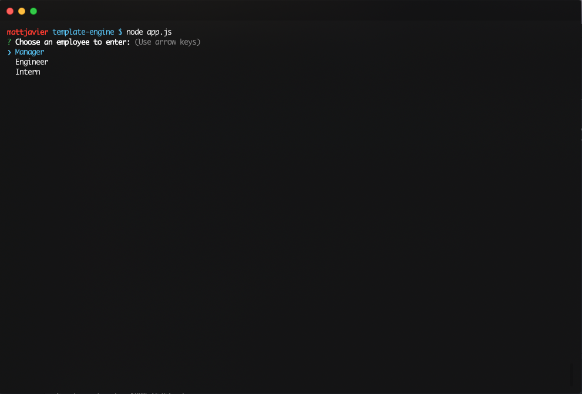
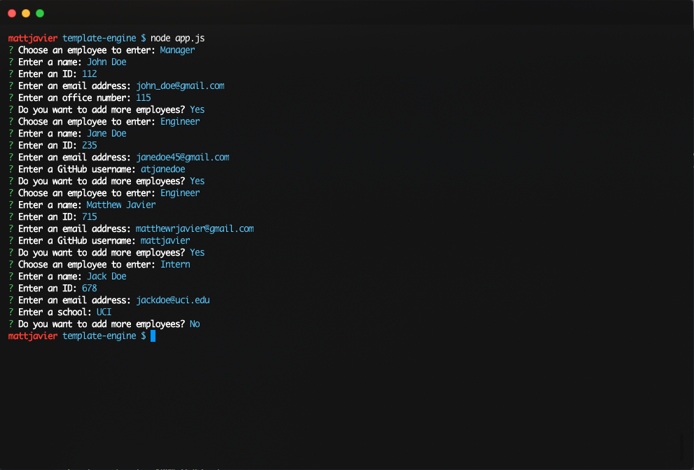
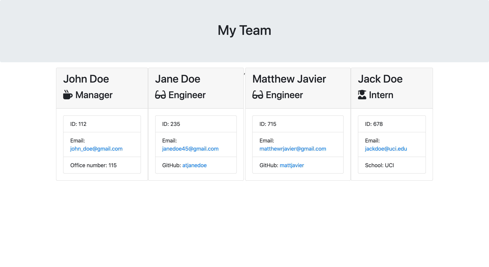
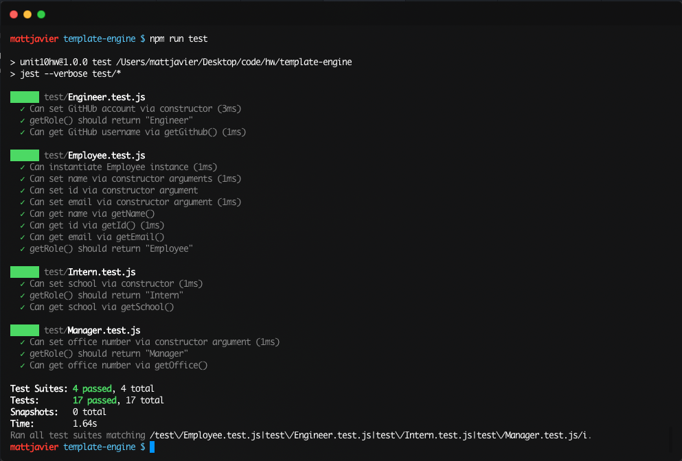

# Employee Template Engine

A CLI Node program that takes in user input about employees and generates an HTML webpage displaying the appropriate information about each employee.

The program utilizes the [Inquirer npm package](https://github.com/SBoudrias/Inquirer.js/) to prompt the user for information about different employee types. Using JavaScript class constructors to store the information, HTML templates for all types of employees are then easily generated. 

## Usage 

To run, type the following into your terminal:

    node app.js

The output of the program will be an HTML file called `team.html` in the `output/` directory. 

## Images

* The initial start of the program with the initial question.
  

* Example output of the finished program.
  

* Example output template generated. 
  

* Passed all tests

## Demo Video

A demo video is available in the `assets/` directory. It can also be viewed [here](https://drive.google.com/file/d/1zIPtXqEa9CxYI26jLwv5IfI9YN42R8x-/view)